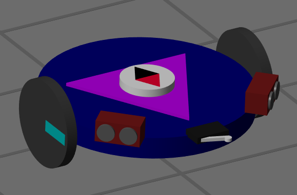
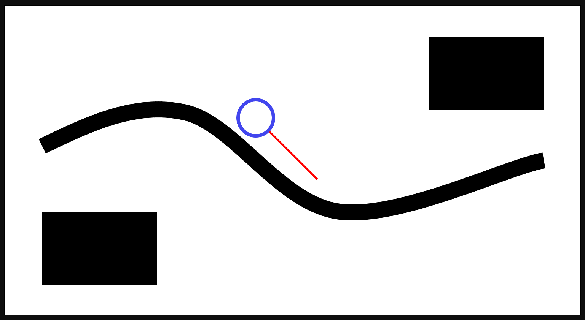

# Awesome Robotics Teaching with MATLAB and Simulink

  

Collection of curriculum and useful examples for robotics and autonomous systems education using MATLAB&reg; and Simulink&reg; for different stages of learning.

Content classification:
* **(Beginner)** Suggested for anyone new to MATLAB/Simulink and new to robotics (STEM Education)
* **(Intermediate)** Suggested for those with foundational engineering knowledge and basic MATLAB skills ([MATLAB Onramp Recommended](https://matlabacademy.mathworks.com/details/matlab-onramp/gettingstarted))
* **(Advanced)** Recommended for anyone with working knowledge in robotics theory, programming experience, and basic MATLAB skills

Looking for content specific to robotics applications? Check out the [Awesome-MATLAB-Robotics GitHub repository](https://github.com/mathworks-robotics/awesome-matlab-robotics) instead.

**NOTE:** *For content additions open a GitHub Issue on the repository*

  

## Overview Resources
| (Beginner) | (Intermediate) | (Advanced) |
| :---: | :---: | :---: |
| Learning Robotics Basics with MATLAB (Video) | Robotics Education with MATLAB (Video)| Teaching Robotics with MATLAB (White-Paper) |
|  |  |   |

## Featured Books
* [Robotics, Vision and Control 3rd Edition (Peter Corke, Witold Jachimczyk, Remo Pillat)](https://github.com/petercorke/RVC3-MATLAB)

## Educational Hardware 
* [Quanser Pick and Place labs](https://www.mathworks.com/matlabcentral/fileexchange/125250-quanser-qarm-pick-and-place-using-mathworks-toolboxes)
* [VEX Robotics V5 support](https://www.mathworks.com/matlabcentral/fileexchange/68649-simulink-coder-support-package-for-vex-edr-v5-robot-brain)
* [Turtlebot support](https://www.mathworks.com/matlabcentral/fileexchange/55578-ros-toolbox-support-package-for-turtlebot-based-robots)
* [ROS on Raspberry Pi](https://www.mathworks.com/help/supportpkg/raspberrypi/ref/getting-started-with-robot-operating-system-ros-on-raspberry-pi-r.html)

## Learning Topics

### Introduction to Robotics

[(Beginner) Robotics Playground [Curriculum]](https://www.mathworks.com/matlabcentral/fileexchange/67157-robotics-playground?s_tid=srchtitle)

        9 Lessons covering how to use distance sensors, encoders, limit switches, and MATLAB and Simulink basics.
                  

[(Beginner) Mobile Robotics Tutorials [Curriculum | Videos]](https://www.mathworks.com/videos/series/student-competition-mobile-robotics-training.html)

        5 Video tutorials teaching basics programming skills and controls theory for autonomous path navigation.
                  

[(Intermediate) Control of Mobile Robots [Curriculum]](https://www.mathworks.com/academia/courseware/control-mobile-robots.html)

        7 Lessons covering controllers, PID, Obstacle avoidance, controller arbitration, wall following and complete navigation system.

[(Intermediate) Applied Autonomous Robots I [Curriculum]](https://www.mathworks.com/academia/courseware/applied-autonomous-robots-1.html)

        9 Lessons and exercises including basic code development, kinematics, perception, control, trajetories, potential fields, and a computer vision teaser.

[(Advanced) Applied Autonomous Robots II [Curriculum]](https://www.mathworks.com/academia/courseware/applied-autonomous-robots-2.html)

        9 Lessons covering basics of computer vision, physics of color, visual servoing, filtering, camera calibration, K-means clustering and Kalman filters.

[(Advanced) Robotics Playground Expansion Pack [Curriculum]](https://www.mathworks.com/matlabcentral/fileexchange/80080-robotics-playground-expansion-pack?s_tid=srchtitle)

        5 Lessons on Robot Navigation, Robot Manipulation, Contact Modeling, Path Planning implemented in a 3D simulator with realistic physics.

### Physics and Mechanics

[(Beginner) Physics Course with Symbolic Math [Curriculum]](https://www.mathworks.com/matlabcentral/fileexchange/68799-physics-course-with-symbolic-math-toolbox-and-live-editor)

        Chapter 4 includes live script covering classical mechanics

[(Intermediate) Electromechanical Systems [Curriculum]](https://www.mathworks.com/academia/courseware/electromechanical-engineering-systems.html) 

        13 Lessons covering electromechanics in depth. Some topics include digitization, electrical systems, control systems basics, filter design, PWM, physical modeling, discretization,and DC motors.

[(Advanced) Modeling, Design, and Control of Robotic Mechanisms - Kyungnam University (Curriculum)](https://www.mathworks.com/academia/courseware/modelling-design-control-robotic-mechanisms.html)

        4 Topics covering planar robot dynamics, 2-DOF simulation, real-time control and an arduino project for a walking robot.

### Controls and Estimation

[(Beginner) Controls Tutorials - University of Michigan (Curriculum)](https://ctms.engin.umich.edu/CTMS/index.php?aux=Home)

        70+ Control system tutorials including system modeling and analysis, controller design and analysis, simulation, and physical modeling, for 8 applications (motors, automobile, aircrafts, pendulums, etc).

[(Beginner) Transfer Function Analysis of Dynamic Systems (Curriculum)](https://www.mathworks.com/academia/courseware/transfer-function-analysis.html)

        4 lessons and live scripts covering transfer functions, pole-zero and frequency domain analysis.

[(Beginner) Control Design Onramp with Simulink (Interactive Tutorials)](https://matlabacademy.mathworks.com/details/control-design-onramp-with-simulink/controls)

        1-Hour interactive tutorial covering the basics of plant modeling, linearization, feedback control and PID tuning.

[(Intermediate) Control of Mobile Robots (Curriculum)](https://www.mathworks.com/academia/courseware/control-mobile-robots.html)

        7 Lessons covering controllers, PID, Obstacle avoidance, controller arbitration, wall following and complete navigation system.

[(Intermediate) Embedded Control and Mechatronics - Southern Illinois University (Curriculum)](https://www.mathworks.com/academia/courseware/embedded-control-mechatronics.html)

        14 Lectures and 2 projects covering, dynamic system modeling, system identification, simulation of nonlinear systems, analysis of linear control systems, lead-lag control, PID, LQR, oprimization-based control, and LQG.Projects use Arduino for hardware implementation.

[(Advanced) Feedback linearization and nonlinear control of two link robots [Example]](https://www.mathworks.com/matlabcentral/fileexchange/115365-feedback-linearization-control-two-link-robot-using-matlab?s_tid=srchtitle)

        Simulation of a two-link robot corresponding to Example 6.2 of Applied Nonlinear Control by Slotine.

[(Advanced) Reinforcement Learning with MATLAB (Curriculum)](https://www.mathworks.com/matlabcentral/fileexchange/111460-reinforcement-learning-rl-with-matlab)

        4 Learning Modules on reinforcement learning covering Q-learning for MDP, Stochastic Gridwrold with DQN, thermal control with DDPG Agent, and robot walking.

### Sensing and Perception

[(Beginner) Intro to Image Processing - University of Wisconsin-Madison](https://serc.carleton.edu/teaching_computation/workshop_2020/activities/239248.html)

        This short project introduces students to image processing with MATLAB including importing images from the web, color transformations, circle finding, and edge finding.

[(Beginner) Getting Started with Perception [Videos | Examples]](https://www.mathworks.com/videos/series/making-vehicles-and-robots-see-getting-started-with-perception-for-students.html)

    Video tutorials and examples for:
    <ul>
         <li>Basic Image Processing </li>
         <li>Image Segementation</li>
         <li>Feature Matching and Tracking</li>
         <li>Point-Cloud Processing</li>
         </ul>

[(Beginner) Image Processing Onramp with MATLAB](https://matlabacademy.mathworks.com/details/image-processing-onramp/imageprocessing)

        2-Hour interactive course covering image handling in MATLAB, image segmentation, pre and post processing techniques,classification, and batch processing.

[(Intermediate) Computer Vision Onramp (Self-Paced Tutorials)](https://matlabacademy.mathworks.com/details/computer-vision-onramp/orcv)

            2-Hour interactive tutorial covering processing of video data, feature extraction and matching, object detection, and tracking.

[(Intermediate) Image processing with MATLAB (Self-paced Course)](https://matlabacademy.mathworks.com/details/image-processing-with-matlab/mlip)

            11-Hour interactive tutorial covering working with images, segmentation based on color and texture, object detection, edge and shape detection, batch processing, and image registration.

[(Advanced) Deep Learning Onramp (Self-Paced Course)](https://matlabacademy.mathworks.com/details/deep-learning-onramp/deeplearning)

        2-Hour interactive tutorial covering usage of pre-trained neural networks, image management, and transfer learning for classification.

### Programming and Embedded Computing

[(Beginner) Intro to MATLAB Programming (Self-Paced Course)](https://matlabacademy.mathworks.com/details/matlab-onramp/gettingstarted)

        2-Hour Introduction to programming tutorial using MATLAB. Covering programming environment, relational operators, arrays, vectors, matrices, functions, plotting, and data import. 

[(Intermediate) MATLAB and Simulink ROS Tutorials [Curriculum]](https://www.mathworks.com/matlabcentral/fileexchange/118630-matlab-and-simulink-ros-tutorials)

        9 Lessons with hands-on projects teaching the basics of interacting with robots powered by ROS (Robot Operating System).

[(Advanced) Getting Started with MATLAB, Simulink and ROS [Examples | Videos | GitHub]](https://github.com/mathworks-robotics/getting-started-ros)
 
      Examples and video tutorials on:
         <ul>
         <li>Using MATLAB with ROS </li>
         <li>Using Simulink with ROS</li>
         <li>Automatic Code Generation for ROS Nodes</li>
         <li>Distributed Computing Using ROS</li>
         </ul>

   

### Robot Intelligence 
**Navigation, Localization, Mapping and SLAM**
    

[(Beginner) Introduction to Mobile Robotics (Self-paced Tutorials)](https://www.mathworks.com/videos/series/student-competition-mobile-robotics-training.html)

            5 Video tutorials with accompanying simualtions covering robot control, PID design, line following, obstacle detection and path navigation.
    

    

    
[(Beginner) Navigation Stack Templates for Mobile Robots [Examples | Videos]](https://www.mathworks.com/matlabcentral/fileexchange/95998-autonomous-navigation-for-mobile-robots-and-ugv?s_tid=srchtitle)

    Reference application and examples for:
    <ul>
    <li> Mapping</li>
    <li> Path Following</li>
    <li> Path Planning</li>
    <li> Trajectory Generation</li>
    <li> Monte Carlo Localization</li>
    <li> SLAM</li>
    </ul>
    

    

    
[(Intermediate) Localization and Kalman Filters [Curriculum]](https://www.mathworks.com/matlabcentral/fileexchange/109485-lessons-on-mobile-robot-localization-and-kalman-filters?s_tid=srchtitle)

            6 Lessons explaining the basics of landmark-based robot localization including: Sensor processing, robot control, localization and kalman filter theory, and ROS implementation.
    

    
**Manipulation**
    

    
[(Beginner) Forward/Inverse Kinematics of 2-link robots [Interactive Example]](https://www.mathworks.com/matlabcentral/fileexchange/69892-inverse-kinematics-of-a-2-link-robot-arm?s_tid=srchtitle)

    Example and simulation explaining how to derive forward/inverse kinematics, and jacobian of a 2-link chain. With final project robot writing "hello" with end effector.
    

    

    
[(Begineer) Workspace Analysis of Planar n-DOF robots [Example]](https://www.mathworks.com/matlabcentral/fileexchange/71136-plotworkspace-plot-workspace-of-n-dof-planar-robot?s_tid=srchtitle)

    Use this function to visualize and analyze the workspaces of planar robots from their DH parameters.
    

    

    
[(Intermediate) Modeling and Control of Serial Manipulators using Dual-Quaternions](https://github.com/dqrobotics/learning-dqrobotics-in-matlab/tree/master/robotic_manipulators)

            8 Lessons covering how to use Dual-Quaternion (DQ) robot representations for kinematic modeling and robot control.
    

    

[(Intermediate) Designing Manipulator Algorithms [Examples | Simulations]](https://www.mathworks.com/matlabcentral/fileexchange/65316-designing-robot-manipulator-algorithms?s_tid=srchtitle)

    Reference application and examples demonstrating:
    <ul>
    <li> Task Space Control</li>
    <li> Joint Space Control</li>
    <li> Forward/Inverse Kinematics</li>
    <li> Closed-loop control</li>
    <li> Supervisory logic and task scheduling</li>
    <li> Actuator Modeling</li>
    </ul>
    

    
**Planning**
    

No content yet :'( Any suggestions for this topic?

    

**Collaboration (Multi-Robot, Human-Machine)**
    

[Modeling Multi-Agent Robot Systems - University of Washington](https://www.pronobis.pro/teaching/mas/)

            4 Lectures and accompanying code examples covering deling multi-agent systems, graph theory for interaction, agreement protocol for rendezvous, and formation control.
    

    

### Machine Learning

**Reinforcement Learning**
    

[(Begineer) Reinforcement Learning Onramp [Self-Paced Course]](https://matlabacademy.mathworks.com/details/reinforcement-learning-onramp/reinforcementlearning)

            3 Hour interactive tutorial covering Reinforcement learning overview, defining environments, defining agents, and training agents.
    

    

[(Intermediate) Q-learning for 4-Link robot walker [Interactive Simulator]](https://www.mathworks.com/matlabcentral/fileexchange/72928-4-link-robotic-simulator?s_tid=srchtitle)

            Kinematic simulator for 4-link robot walking demonstrating practical programming, inverse kinematics, Q-learning for motion control, and simulated annealing.
    

    

[(Intermediate) Reinforcement Learning with MATLAB (Curriculum)](https://www.mathworks.com/matlabcentral/fileexchange/111460-reinforcement-learning-rl-with-matlab)

            4 Learning Modules on reinforcement learning covering Q-learning for MDP, Stochastic Gridwrold with DQN, thermal control with DDPG Agent, and robot walking.
    

  

## Instruction and Grading Tools
* [Interactive features for teaching](https://www.mathworks.com/academia/online-teaching/instructional-resources.html)
* [Online assignments and automatic grading](https://www.mathworks.com/academia/online-teaching/online-assessments.html)
* Work on the cloud with [MATLAB Online](https://www.mathworks.com/products/matlab-online.html) and [MATLAB Drive](https://www.mathworks.com/products/matlab-drive.html)

## More content
Didn't find what you were looking for? Try the following links to more teaching resources:
* [MATLAB and Simulink Courseware search](https://www.mathworks.com/academia/courseware.html)
* [MATLAB File Exchange search](https://www.mathworks.com/matlabcentral/fileexchange/)

*Did we miss something?*
* Submit requests to add content by opening an issue in the repository

Copyright 2022 The MathWorks, Inc.
